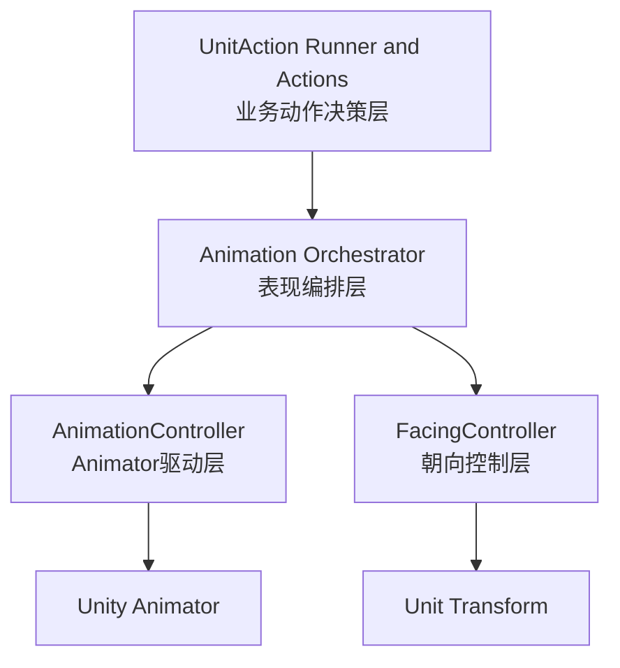

# 动画系统分层与边界

## 1. 目标

- 明确动画相关模块的单一职责，避免一个类同时处理动作决策、朝向、Animator 细节。
- 建立稳定依赖方向，防止 Action 层直接耦合到 Unity Animator 细节。
- 为后续请求模型、事件协议、Token 机制重构提供边界约束。

## 2. 非目标

- 本文不定义具体 Animator Controller 图状态名。
- 本文不包含具体代码实现细节。
- 本文不覆盖 Buff/Skill 业务规则本身。

## 3. 分层模型

## 4. 各层职责

### 4.1 业务动作决策层

位置建议: Assets/Scripts/Units/Actions/

职责:
- 决定何时开始攻击、施法、移动、打断。
- 决定动作完成后的业务效果执行时机。
- 只表达业务意图，不处理 Animator 参数细节。

禁止:
- 直接调用 Animator API。
- 直接修改角色朝向。

### 4.2 表现编排层

位置建议: Assets/Scripts/Units/Animation/AnimationOrchestrator.cs

职责:
- 将业务动作意图转换为动画命令和朝向命令。
- 维护动作生命周期 Token，连接动作开始与动画结束事件。
- 对非法命令进行输入校验和可观测日志输出。

禁止:
- 决定业务是否可施放技能。
- 承担 Buff/伤害结算逻辑。

### 4.3 Animator驱动层

位置建议: Assets/Scripts/Units/Animation/AnimationController.cs

职责:
- 仅负责把编排层命令映射为 Animator 参数写入和 Trigger 触发。
- 维护与 Animator 相关的最小状态缓存(仅调试用途)。
- 提供统一入口 Apply(command)，屏蔽底层 Animator 细节。

禁止:
- 直接决定角色朝向。
- 处理动作优先级和抢占。

### 4.4 朝向控制层

位置建议: Assets/Scripts/Units/Movement/FacingController.cs

职责:
- 接收朝向意图并更新 Transform 旋转。
- 处理朝向插值、瞬转策略、朝向锁定等纯空间逻辑。

禁止:
- 触发 Animator 参数。
- 参与动作生命周期 Token 校验。

## 5. 依赖方向约束

允许依赖:
- Action -> Orchestrator
- Orchestrator -> AnimationController
- Orchestrator -> FacingController
- AnimationController -> Animator
- FacingController -> Transform

禁止依赖:
- Action -> AnimationController
- Action -> FacingController
- AnimationController -> UnitAction Runner
- FacingController -> Animator

## 6. 动画交互协议(边界版本)

### 6.1 下行命令

- Action 层向 Orchestrator 发起语义命令:
  - StartAttack
  - StartCastSkill
  - StopCurrentAction
  - PlayDeath

- Orchestrator 将语义命令拆分为:
  - 动画命令(给 AnimationController)
  - 朝向命令(给 FacingController，可选)

### 6.2 上行动画事件

- Animator Event -> Unit -> ActionRunner 通知当前 Action。
- 当前 Action 必须通过 Token 校验事件归属。
- 校验失败时只记录日志，不执行业务效果。

## 7. 状态机原则

- Animator 参数与 Transition 是动画状态唯一事实源。
- 代码层不再使用硬切某个固定状态名来驱动主流程。
- 代码中的状态字段仅用于调试展示，不可作为业务判断条件。

## 8. 错误与可观测性

必须记录日志的场景:
- 非法命令输入(缺少必要字段或组合无效)。
- 收到未知动画事件名。
- Token 不匹配导致事件被丢弃。

日志字段最低要求:
- unitId 或 unitName
- actionType
- token
- eventName
- timestamp

## 9. 迁移策略(与后续Todo对齐)

- 第一步: 引入 Orchestrator 与边界接口，不改行为。
- 第二步: 将 AttackAction 和 CastSkillAction 改为只调用 Orchestrator。
- 第三步: 把朝向逻辑从 AnimationController 完全移出。
- 第四步: 下线旧 version 校验，切换到 Token。
- 第五步: 收敛 AnimationController 对外 API。

## 10. Todo1 验收标准

- 有明确且可执行的层职责定义。
- 有禁止跨层调用规则。
- 有事件流与依赖方向说明。
- 能直接指导 Todo2 到 Todo7 的代码改造。
